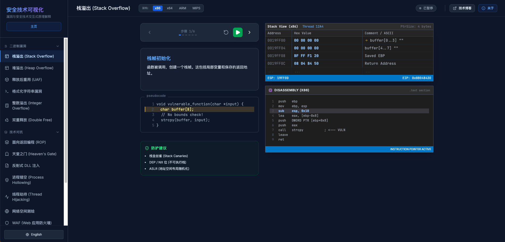

#  SecTech Vis 安全能力可视化

SecTech Vis  是一个双语（中/英）的“二进制计数对抗与 Web 安全”交互式可视化平台。通过分步动画、伪代码高亮、缓解/检测清单和直观的流程图，帮助你快速理解各类漏洞的形成机制与攻防思路。

[sectechvis](https://tipfactory.jentletao.top/):`https://tipfactory.jentletao.top/`(现在没钱买域名)

## 平台功能
- 分类导航：`Binary`、`Adversarial`、`Web`、`Algorithm` 四大类，侧边栏一键切换。
- 交互演示：播放/暂停、上一步/下一步，逐步呈现漏洞形成过程与关键状态变化。
- 伪代码联动：右侧代码区按步骤高亮关键行，帮助建立“流程 ↔ 代码”心智模型。
- 攻防清单：在“缓解建议/检测点”之间切换，既看防护要点也看监测线索。
- 架构切换：部分二进制类支持 `x86/x64/ARM-LE/ARM-BE`，寄存器/栈等展示随架构联动。
- 双语支持：右下角可切换 `EN/中文`。
- 典型漏洞可视化：包含但不限于 `Stack/Heap/UAF/Format String/Integer Overflow/Double Free/ROP/Heavens Gate/Reflective DLL/Process Hollowing/Thread Hijacking/Network Mapping/WAF/IPS/AES` 以及 Web 类 `SQLi/SSRF/CSRF/XXE/XSS/反序列化/Log4Shell/Next.js RCE/路径穿越`。

## 技术栈

- 前端框架：`React` + `TypeScript`
- 构建工具：`Vite`
- UI/样式：`Tailwind CSS`（通过 CDN 注入，见 `index.html`）
- 图标库：`lucide-react`

## 页面布局设计

- 网格布局：主内容区采用 `12 列 grid` 布局，典型分栏如下：
  - 左栏：步骤控制条、当前步骤说明、伪代码区（`lg:col-span-5` 或 `3`）
  - 中栏：可视化画布（`lg:col-span-7` 或 `6`）
  - 右栏：在 ROP 等专题显示流程图与缓解清单（`lg:col-span-3`）
- 粘性策略：
  - 顶部栏 `h-16` 固定；
  - 步骤控制条使用 `sticky top-16 z-10`，滚动时始终可操作且不被遮挡。
- 代码区高亮：根据当前步骤 `highlightLines` 联动高亮，保持“过程 → 代码”一致性。
- 视图切换：检测点与缓解建议通过 `useDetectionPoints` 自动匹配展示逻辑。

## 快速开始

- 环境要求：`Node.js 18+`
- 安装依赖：
  - `npm install`
- 本地开发：
  - `npm run dev`
  - 控制台会输出地址，例如 `http://localhost:3001/`
- 构建与预览：
  - `npm run build`
  - `npm run preview`

## 使用指南
- 选择分类与漏洞：侧边栏进入相应专题（例如 `WEB → 路径穿越`）。
- 播放流程：顶部控制条可 `播放/暂停/重置/前进/后退`；下方进度条展示当前步骤位置。
- 阅读说明与伪代码：左栏“当前步骤说明”与“pseudocode”联动高亮关键逻辑。
- 查看攻防要点：左栏底部面板在 `缓解建议 / 检测点` 之间切换展示。
- 二进制架构：顶部标题右侧可切换架构，观察寄存器/栈等差异化展示。

## 扩展开发（以新增 Web 漏洞为例）
1. 类型与伪代码：在 `types.ts`
   - 增加 `ExploitType.<YourExploit>` 枚举值
   - 定义对应 `*_CODE_SNIPPET`
   - 如需专用步骤字段，在 `AnimationStep` 补充（遵循现有命名风格）
2. 可视化组件：在 `components/` 新增 `<YourExploit>Visualizer.tsx`
   - 参照现有 Web 模块（如 `XssVisualizer`, `PathTraversalVisualizer`）的布局与数据绑定模式
3. 页面接入：在 `App.tsx`
   - `I18N` 增加中文/英文文案（标题、步骤描述）
   - `MITIGATIONS` 与 `DETECTION_POINTS` 增加对应清单
   - `getSteps(...)` 增加该漏洞的步骤生成分支
   - 代码片段 `getCodeSnippet()` 增加映射
   - 侧边栏 `MenuItem` 增加入口与图标
   - 中间内容区增加 `<YourExploit>Visualizer` 渲染分支

## 贡献
- 欢迎提交 PR 与 Issue，建议遵循现有组件与步骤命名风格，便于统一维护与文档化。
- 新需求和ToDo可以在issue上提交，作者有时间的活会更新（但愿）。
